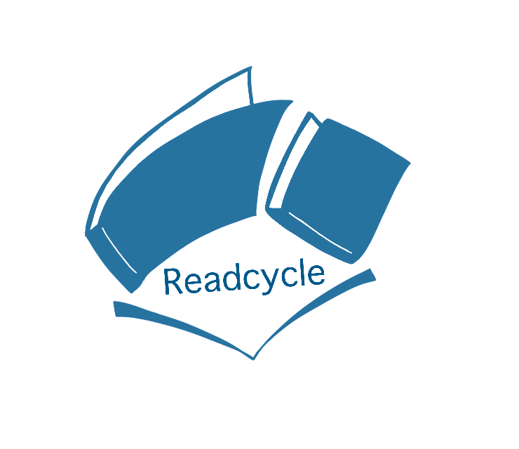
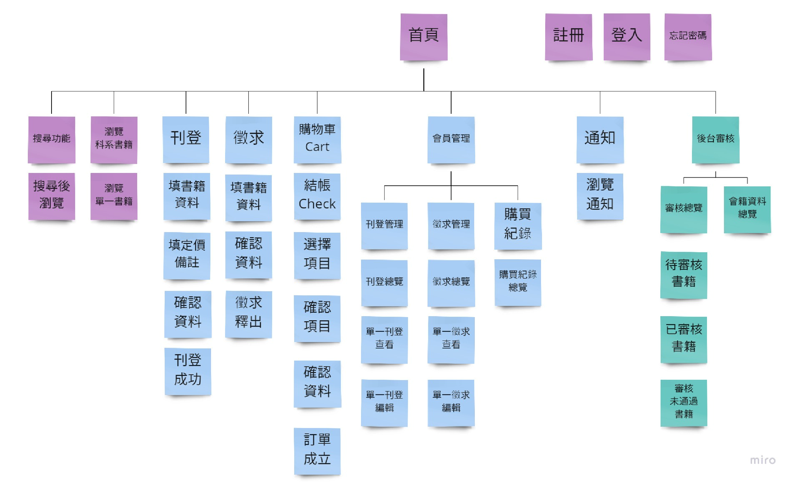

# :books: WEB PROGRAMMING_2021(109-2)
> * **課程名稱：**【BDM11302】網頁程式設計Web Programming
> * **指導老師：** **_金凱儀老師、蘇明祥老師_**

---

## :bulb: 網頁程式設計【第九組】期末專題
> * **專案名稱：** 【Readcycle 書適圈】 
> * **成員簡介**
>
> | 組員  |  系級  |專題職位|
> | :------: |  :--------:  | :-----: |
> | 黃凱琳 | 企三A | Leader、Back-end Engineer|
> | 洪鈺姍 | 企延B | Back-end Engineer、Database Engineer|
> | 陳叔孟 | 英四A | Art Designer、Front-end Engineer|
> | 柳映萱 | 巨資三A | Front-end Engineer|
> | 林盈秀 | 日二Ｂ | Front-end Engineer|
> 
> * **創作理念：**  
>   * 痛點：  
>       1. **部分教科書購買後使用率不高且後續再使用率低**  
> 　　上課使用教科書是學生們必經之事，實際上，當今各大專院校裡買賣二手書的風氣可謂十分盛行。對買家而言，評估價格與使用頻率後，認為購入全新教科書並不划算，尤偏好書上有筆記的群體，二手書會是個更好的選擇。對賣家而言，存放書籍需要占用空間，況且這些書籍後續使用率低，若是成功賣出也能賺回部分的書錢。  
>       2. **傳承風氣是好，然並非所有直屬皆想要**  
> 　　許多人買書後可能會覺得之後留給學弟妹，是一個不錯的處理書的方式，亦可能因為此讓自身學長姊的觀感變佳，然也許直屬並不想要二手書，抑或是喜歡擁有自己的書，以上種種會造成自己的書滯銷。
>       3. **東吳二手教科書的臉書社團使用率雖高，卻不方便媒合**  
> 　　在學期結束及新學期開始之際，透過FB社團進行交易的同學不計其數，然平臺使用起來並不方變。一為受到貼文消息排序的影響，買賣雙方很容易錯過媒合的機會。再則，若從沒有分類的茫茫貼文海中，使用者要搜尋資訊根本無從找起，亦是代表要靠「運氣」才能讓這筆交易找到買賣雙方。
> * **主要構想與施行目的：**  
>   * **架設二手書媒合平臺**：  
> 　　製作一個書籍買賣交易平臺，匹配具有刊登或徵求書籍的學生，以減少學生轉賣和徵求書的困擾，且盡可能降低學生為了省錢而進行非法影印的情況。
>   * **使用帳號為學號及教職員編號**：  
> 　　為降低買賣交易這類涉及金額交易而產生的部分風險，將使用者限定為東吳大學校內的師生，此舉可嚴謹地控管平臺的使用者，以避免來路不明的人隨意廣告抑或是詐騙等等。
<!-- >   * **媒合成功將通知徵求、刊登雙方**：  
> 　　類似購物平臺，一旦訂單達成，隨即通知買賣雙方，此舉可以提高學生買賣二手書成交率，並不需要使用者時時在上面刷新頁面等待即時消息。 -->

### :star2:【ReadCycle 書適圈】專案成果
> * Logo：  
>   
> 
> * 介面設計流程架構圖：  
>    
> 以網頁功能頁面作為分類，分為以下七大主要項目：  
>   * **首頁**：ReadCycle入口的主要頁面。  
>    
>  
>   * **註冊/登入**：使用者的註冊以及登入頁面。
>   * **刊登**：賣家想要賣書時需使用刊登將自己的書於平臺上架。
>   * **徵求**：買家想要買書時需使用徵求將自己的需求用書於平臺張貼資訊。
>   * **購物車結帳**：將選購的書籍加入購物車並進行結帳流程以產生訂單。
>   * **會員管理**：使用者的會員相關功能，例如：刊登或徵求的管理與記錄、訂單記錄。
>   * **後臺審核**：管理者的特定功能，例如：刊登與徵求的審核總覽、會籍資料總覽。
>
> * 資料庫設計實體關聯圖(ERD)
> _ERD.png)
>
> * Code
>   
> | 項目 | 說明 |   
> | :-----: | :-------- |
> |[bootstrap-3.3.7-distv](./Recycle_Code/bootstrap-3.3.7-dist)|為了網頁功能列中的icon可以使用popover彈出提示框的效果|
> |[conn](./Recycle_Code/conn.php)|連結Local端資料庫|
> |[home](./Recycle_Code/php/home.php)|ReadCycle首頁頁面，即為整個專案的開始入口|
> |[home.js](./Recycle_Code/home.js)|為了網頁首頁上的圖片輪播功能以及利用onmouseover使滑鼠切換頁籤的效果|
> |[各頁面檔名對照表](https://reurl.cc/3jq1b8)|由於檔案過多，故已先整理好各頁面與之相聯結的相關檔案|
> 
> * Report
> 
> | 成果 | 說明 |   
> | :-----: | :-------- |
> |[PPT](./report/Readcycle(書適圈)_期末簡報.pdf)|書適圈(ReadCycle)的期末專題簡報|
> |[專案企劃書](./report/Readcycle(書適圈)_期末企畫書_final.pdf)|書適圈(ReadCycle)的期末專題完整企畫書【書面報告】| 
> |[Figma](https://reurl.cc/Ep5KbK)|初步設計的ReadCycle頁面後才據此刻出網頁並加以修改調整| 
> |[網頁Demo](https://youtu.be/bHd_7tuHBwI)|完整使用書適圈(ReadCycle)平臺服務的示範(Demo)影片|
> |[期末專題匯報](https://youtu.be/Cd6E2e_7ho0?t=8193)|2021/06/30 期末專題線上匯報影片【起：2:16:33 ~ 迄：2:40:39】|
